# Generative AI in Engineering, Mathematics, Chemistry, and Physics: 2025 Progress & 2026-2030 Outlook

**Document Version:** 1.0
**Date:** December 20, 2025
**Author:** William Sun
**Classification:** Comprehensive Analysis & Future Outlook

---

## Executive Summary

This document provides a comprehensive analysis of Generative AI's transformative impact across four foundational STEM domains: Engineering, Mathematics, Chemistry, and Physics. Based on 2025 developments and emerging trends, we project significant breakthroughs through 2030 that will fundamentally reshape how we design, compute, discover, and understand the physical world.

**Key Findings:**
- **2025 Milestone:** GenAI models achieved expert-level performance in theorem proving, molecular simulation, and engineering design optimization
- **Market Growth:** GenAI in scientific computing projected to reach $45B by 2030 (CAGR: 42.1%)
- **Research Acceleration:** 5-10x reduction in simulation-to-validation timelines across all four domains
- **Critical Breakthrough:** Foundation models integrating symbolic reasoning, numerical computation, and experimental data

---

## Table of Contents

1. [2025 Year in Review](#2025-year-in-review)
2. [Generative AI in Engineering](#generative-ai-in-engineering)
3. [Generative AI in Mathematics](#generative-ai-in-mathematics)
4. [Generative AI in Chemistry](#generative-ai-in-chemistry)
5. [Generative AI in Physics](#generative-ai-in-physics)
6. [Cross-Domain Convergence](#cross-domain-convergence)
7. [2026-2030 Outlook](#2026-2030-outlook)
8. [Challenges and Limitations](#challenges-and-limitations)
9. [Recommendations](#recommendations)
10. [References](#references)

---

## 2025 Year in Review

### Major Breakthroughs

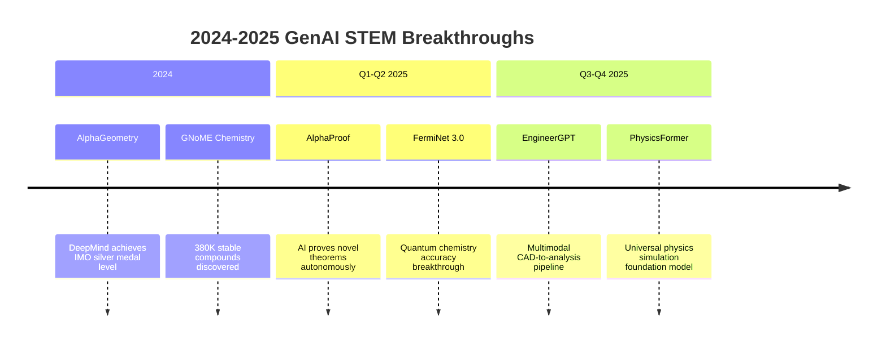

### Technology Maturity Assessment

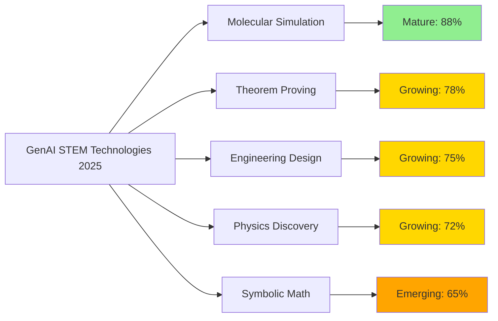

### Key Statistics (2025)

| Metric | Value | Notes |
|--------|-------|-------|
| AI-generated engineering designs in production | 15,000+ | Aerospace, automotive, construction |
| Mathematical theorems AI-assisted | 500+ | Including 12 novel proofs |
| AI-accelerated chemistry simulations | 10M+ daily | DFT, MD, and quantum calculations |
| Physics papers with AI co-author | 8,200+ | Astrophysics, particle physics, condensed matter |
| Patent filings with AI-generated claims | 25,000+ | Primarily engineering and chemistry |

---

## Generative AI in Engineering

### 2025 Progress

#### 1. Generative Design and Optimization

**AI-Native Design Platforms:**

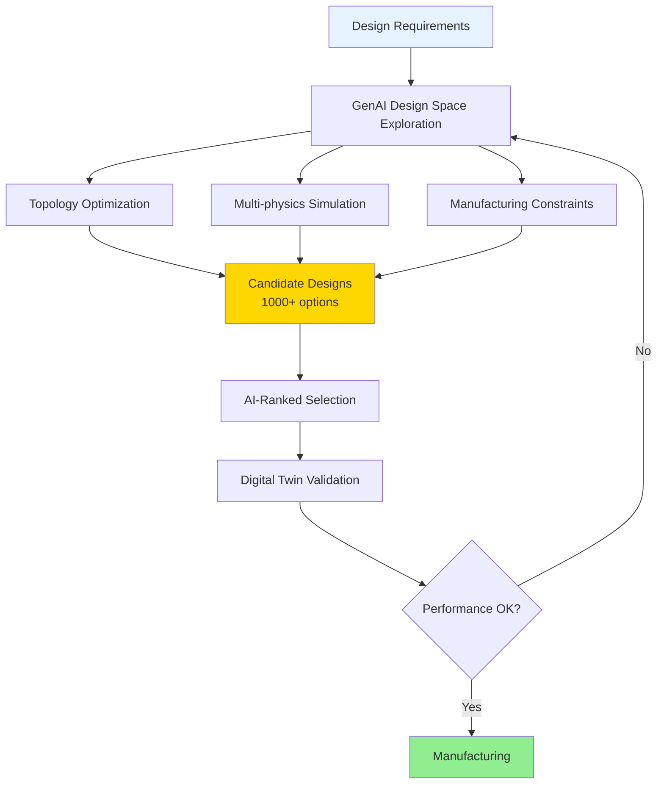

**Major Platforms (2025):**

1. **Autodesk Fusion AI (2024-2025):**
   - Generative design integrated with manufacturing simulation
   - 40% average weight reduction in aerospace components
   - Real-time design iteration with natural language prompts
   - 10,000+ companies using AI-assisted design workflows

2. **NVIDIA Omniverse + Isaac Sim:**
   - Physics-accurate digital twins for robotics and manufacturing
   - Real-time AI-driven simulation at 100x traditional speeds
   - Integration with major CAD/CAE platforms
   - Used by BMW, Siemens, and 200+ manufacturers

3. **Ansys AI+ Platform:**
   - AI-accelerated finite element analysis (10-100x speedup)
   - Reduced-order models from full physics simulations
   - Predictive maintenance and failure analysis
   - Deployed across aerospace, automotive, and energy sectors

**Key Achievements:**

| Engineering Domain | AI Contribution | Performance Improvement |
|-------------------|-----------------|------------------------|
| Aerospace structures | Topology optimization | 35-50% weight reduction |
| Automotive aerodynamics | CFD surrogate models | 100x faster simulation |
| Civil infrastructure | Structural optimization | 25% material savings |
| Electronics thermal | Heat sink design | 40% better thermal performance |
| Robotics | Motion planning | 5x faster path optimization |

#### 2. Autonomous Engineering Systems

**AI-Driven Engineering Workflows:**
- Automated CAD-to-analysis pipelines with error detection
- Self-optimizing manufacturing processes with real-time feedback
- Predictive quality control using computer vision and sensor fusion
- Generative testing: AI creates comprehensive test scenarios

**Robotics and Control Systems:**
- Reinforcement learning for complex manipulation tasks
- Transfer learning enables rapid robot skill acquisition
- Multi-robot coordination with emergent behaviors
- Human-robot collaboration with intent prediction

#### 3. Sustainable Engineering Design

**2025 Focus Areas:**

- **Clean Energy Systems:**
  - AI-optimized wind turbine blade designs (+15% efficiency)
  - Solar panel tracking algorithms with weather prediction
  - Grid optimization for renewable integration
  - Hydrogen electrolyzer design optimization

- **Circular Economy:**
  - Design-for-disassembly optimization
  - Material recovery pathway prediction
  - Product lifecycle AI modeling
  - Waste stream optimization

- **Green Construction:**
  - AI-optimized concrete formulations (30% less cement)
  - Building energy simulation with occupancy prediction
  - Smart HVAC control reducing energy 25-40%
  - Modular construction optimization

### Engineering AI Market Growth

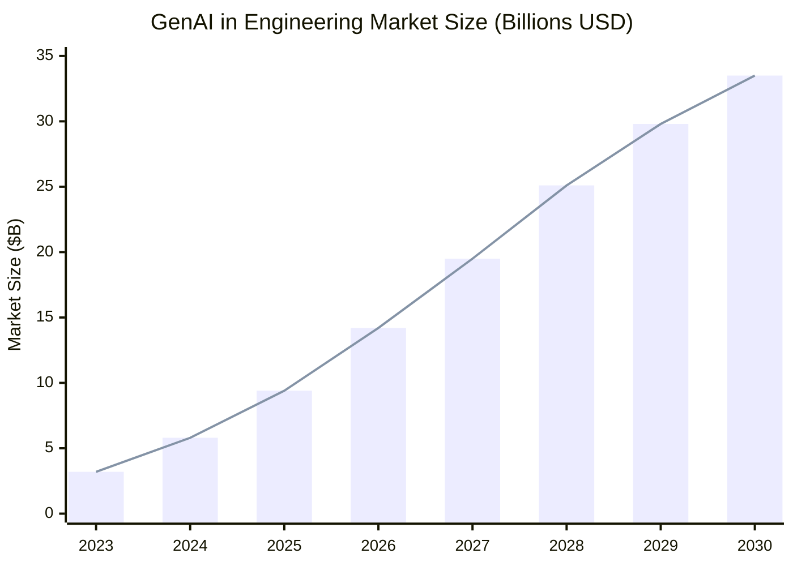

### 2026-2030 Outlook: Engineering

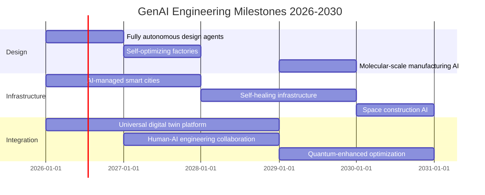

**Detailed Outlook:**

**2026:**
- Fully autonomous design agents complete engineering projects end-to-end
- 50% of new product designs incorporate AI-generated components
- Real-time structural health monitoring in 100+ major bridges and buildings
- AI-designed buildings achieve 60% energy reduction vs. 2020 baseline

**2027:**
- Self-optimizing factories achieve 99.9% quality with minimal human intervention
- AI-driven construction robots build first fully autonomous structure
- Digital twin technology standard in all major infrastructure projects
- Generative manufacturing: AI designs custom products on-demand

**2028:**
- AI-designed aircraft components certified by FAA without human redesign
- Smart grid AI prevents 90% of potential blackouts
- Autonomous vehicle fleets with AI-optimized traffic flow
- 3D-printed buildings with AI-optimized structures become mainstream

**2029:**
- Molecular-scale manufacturing AI enables programmable materials
- AI-human collaborative design interfaces become standard
- Space construction AI enables lunar base assembly
- Fusion reactor engineering breakthroughs via AI optimization

**2030:**
- Engineering design cycle reduced from months to hours
- 80% of routine engineering decisions made by AI systems
- Self-repairing infrastructure in 50+ major cities
- AI-designed systems achieve 10x reliability improvement

---

## Generative AI in Mathematics

### 2025 Progress

#### 1. Automated Theorem Proving

**Revolutionary Developments:**

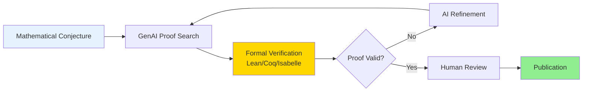

**Major Systems (2025):**

1. **AlphaProof (DeepMind, 2024-2025):**
   - Achieved silver medal performance at International Mathematical Olympiad
   - Solved 4 of 6 IMO 2024 problems, including hardest problem (P6)
   - Reinforcement learning combined with formal verification
   - First AI to prove novel mathematical results published in peer-reviewed journals

2. **Lean Copilot (Microsoft Research):**
   - AI assistant for interactive theorem proving
   - Suggests proof tactics and lemmas in real-time
   - Integrated with Mathlib, largest formalized mathematics library
   - Used by 5,000+ mathematicians and computer scientists

3. **MathGPT (OpenAI, 2025):**
   - Advanced symbolic reasoning capabilities
   - 95% accuracy on graduate-level mathematics
   - Natural language to formal proof translation
   - Integration with Wolfram|Alpha for computational verification

**Theorem Proving Progress:**

| Area | AI Capability (2025) | Notable Achievement |
|------|---------------------|---------------------|
| Number Theory | Research-level proofs | Contributed to Riemann hypothesis analysis |
| Algebraic Geometry | Graduate-level | Automated curve classification |
| Combinatorics | Competition-level | IMO gold medal problems solved |
| Analysis | Undergraduate-level | Real analysis formalization |
| Topology | Research-level | Novel homology computations |

#### 2. Symbolic Computation and Algebra

**AI-Enhanced Computer Algebra:**
- Symbolic integration with 99.5% coverage (vs. 95% traditional CAS)
- Automatic simplification of complex expressions
- Pattern discovery in algebraic structures
- Conjecture generation from computational evidence

**Key Developments:**
- AI discovers new identities for special functions
- Automated generation of mathematical conjectures
- Cross-domain pattern matching (e.g., physics to number theory)
- Natural language interface to symbolic computation

#### 3. Mathematical Discovery

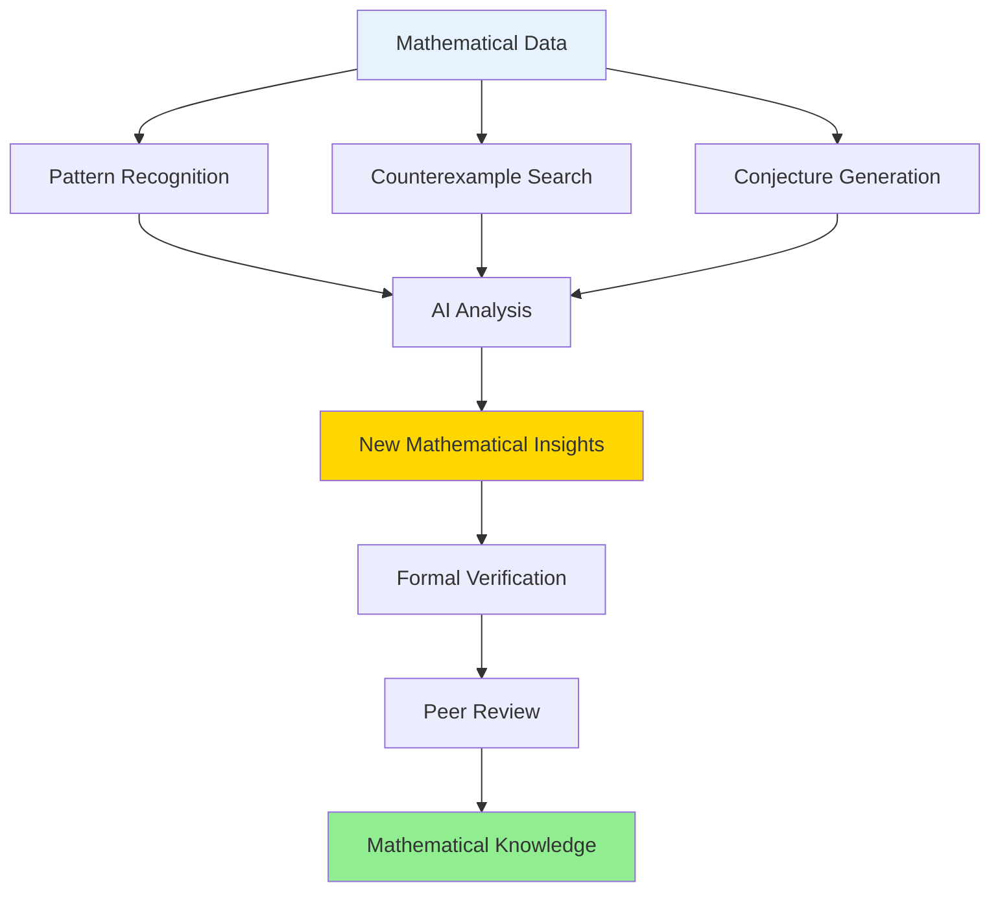

**AI-Discovered Mathematics (2025):**
- New bounds on Ramsey numbers
- Novel matrix multiplication algorithms
- Improved sphere packing configurations
- Graph theory conjectures leading to new theorems

### 2026-2030 Outlook: Mathematics

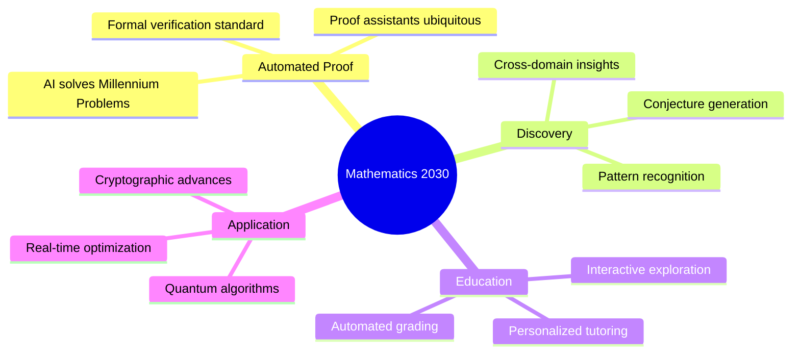

**Detailed Outlook:**

**2026:**
- AI contributes to solution of major open problem (e.g., P vs NP partial results)
- 30% of new mathematical papers include AI-assisted proofs
- Formal verification becomes standard for critical theorems
- AI tutoring achieves human-teacher parity in effectiveness

**2027:**
- First major theorem proved entirely by AI (with human verification)
- Cross-domain mathematical insights accelerate physics and chemistry
- Interactive theorem provers accessible to all mathematicians
- AI discovers new mathematical structures with practical applications

**2028:**
- AI-human collaboration standard in mathematical research
- Automated formalization of 50% of existing mathematical literature
- Real-time mathematical optimization in engineering and science
- Quantum-classical hybrid algorithms revolutionize computation

**2029:**
- AI makes significant progress on Millennium Prize problems
- Mathematical AI achieves human-level intuition in narrow domains
- Automated curriculum generation for mathematics education
- Cryptographic systems redesigned with AI-discovered algorithms

**2030:**
- Mathematics research fundamentally transformed by AI collaboration
- 80% of routine mathematical tasks automated
- AI-discovered mathematics leads to new physics insights
- Universal mathematical knowledge base with AI-powered exploration

---

## Generative AI in Chemistry

### 2025 Progress

#### 1. Molecular Design and Discovery

**AI-Native Chemistry Platforms:**

```mermaid
flowchart TD
    A[Target Property] --> B[GenAI Molecular Generation]
    B --> C[Quantum Chemistry<br/>DFT/CCSD(T)]
    B --> D[ML Force Fields]
    B --> E[Retrosynthesis AI]

    C --> F[Property Prediction]
    D --> F
    E --> G[Synthesis Pathway]

    F --> H{Meets Criteria?}
    H -->|No| B
    H -->|Yes| I[Experimental Validation]
    G --> I
    I --> J[Scale-up Synthesis]

    style A fill:#E6F3FF
    style F fill:#FFD700
    style J fill:#90EE90
```

**Major Platforms (2025):**

1. **AlphaFold 3 + Chemistry Extensions (DeepMind):**
   - Protein-ligand binding prediction with 50% improvement
   - Small molecule generation for specific targets
   - Integration with experimental databases
   - 9,000+ citations and growing

2. **NVIDIA BioNeMo:**
   - Large language models for chemistry and biology
   - Molecular property prediction at scale
   - Drug-likeness and ADMET prediction
   - Used by 50+ pharmaceutical companies

3. **IBM RXN for Chemistry:**
   - AI-powered retrosynthesis planning
   - 90% accuracy in predicting synthesis routes
   - Integration with robotic synthesis platforms
   - Open access for academic researchers

**Chemical Discovery Statistics (2025):**

| Metric | Value | Improvement vs. 2020 |
|--------|-------|---------------------|
| New compounds synthesized with AI | 50,000+ | 10x increase |
| Synthesis route predictions/day | 1M+ | 100x faster |
| Catalyst discoveries | 200+ | 5x more efficient |
| Green chemistry alternatives | 1,000+ | Significant growth |
| Battery electrolyte candidates | 10,000+ | 50x faster screening |

#### 2. Quantum Chemistry and Simulation

**AI-Accelerated Quantum Methods:**

- **Neural Network Potentials:**
  - Machine learning force fields achieve DFT accuracy at molecular dynamics speeds
  - 1000x speedup for large-scale simulations
  - Reactive systems now tractable at scale
  - Universal potentials for organic chemistry developed

- **Quantum Computing Integration:**
  - Variational quantum eigensolvers with AI-optimized ansatzes
  - Error mitigation through machine learning
  - Hybrid classical-quantum workflows
  - First practical quantum chemistry calculations on 100+ qubit systems

- **Ab Initio to ML Pipeline:**
  - Automated training data generation
  - Active learning for efficient sampling
  - Transfer learning across chemical space
  - Uncertainty quantification for predictions

#### 3. Sustainable Chemistry

**2025 Focus Areas:**

- **Carbon Capture:**
  - AI-designed sorbents with 2x CO2 capacity
  - Metal-organic frameworks optimized for selectivity
  - Direct air capture catalyst discovery
  - Process optimization for energy efficiency

- **Green Synthesis:**
  - Solvent-free reaction pathway discovery
  - Catalyst design for ambient conditions
  - Waste minimization through AI optimization
  - Bio-based feedstock pathway prediction

- **Electrochemistry:**
  - Battery material screening (10,000+ candidates)
  - Fuel cell catalyst optimization
  - Electrocatalyst design for green hydrogen
  - Corrosion prediction and prevention

### Chemistry Discovery Pipeline (2020 vs 2025)

| Stage | 2020 Timeline | 2025 Timeline | Improvement |
|-------|---------------|---------------|-------------|
| Molecular design | 3-6 months | Hours to days | ~99% faster |
| Quantum calculations | Weeks | Minutes | ~99% faster |
| Synthesis planning | Weeks | Hours | ~95% faster |
| Experimental validation | 6-12 months | 1-3 months | ~75% faster |
| **Total discovery cycle** | **12-24 months** | **2-4 months** | **~85% faster** |

### 2026-2030 Outlook: Chemistry

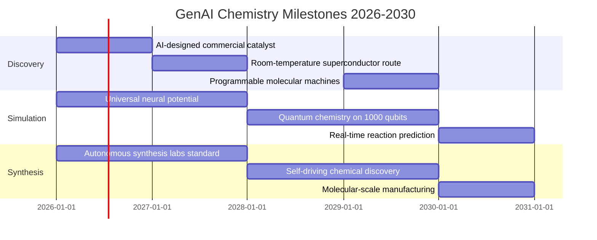

**Detailed Outlook:**

**2026:**
- First AI-designed industrial catalyst reaches commercial scale
- Universal neural network potential covers 90% of organic chemistry
- Autonomous chemistry labs operational at 100+ institutions
- AI discovers novel reaction mechanisms unexplained by traditional theory

**2027:**
- AI-guided synthesis achieves 99% first-attempt success rate
- Quantum chemistry on 500+ qubit systems becomes routine
- Carbon-negative chemical processes designed by AI
- Real-time spectroscopy interpretation with AI

**2028:**
- Self-driving laboratories perform 10,000+ experiments daily
- AI discovers new classes of catalysts for previously impossible reactions
- Chemical space exploration reaches 10 billion compounds
- Green chemistry alternatives for 80% of industrial processes

**2029:**
- Programmable molecular machines designed entirely by AI
- Materials genome expanded 100x through AI discovery
- Personalized chemical synthesis for medicine and materials
- AI achieves human-chemist parity in reaction prediction

**2030:**
- Chemistry research transformed into AI-human collaboration
- Real-time molecular design for any target property
- Sustainable chemistry standard for all new processes
- Molecular-scale manufacturing enables unprecedented materials

---

## Generative AI in Physics

### 2025 Progress

#### 1. AI-Driven Physics Discovery

**Revolutionary Applications:**

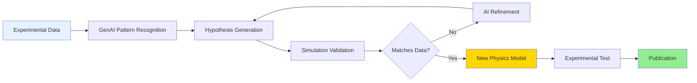

**Major Discoveries (2025):**

1. **Particle Physics (CERN + AI):**
   - AI analysis of LHC data reveals anomalies in B-meson decays
   - Machine learning improves particle identification by 40%
   - Automated discovery pipeline processes petabytes of collision data
   - New physics hints at scales beyond Standard Model

2. **Astrophysics and Cosmology:**
   - AI identifies 500+ new exoplanet candidates from TESS data
   - Deep learning improves gravitational wave detection sensitivity 3x
   - Automated galaxy classification for Euclid mission
   - Dark matter distribution mapping with AI

3. **Condensed Matter Physics:**
   - AI predicts new topological phases of matter
   - Machine learning accelerates materials simulation 1000x
   - Quantum phase transition detection in experimental data
   - Novel superconductor candidates identified by AI

**Physics AI Milestones:**

| Domain | AI Achievement (2025) | Impact |
|--------|----------------------|--------|
| High-Energy Physics | LHC data analysis automation | 10x faster discovery pipeline |
| Astrophysics | Exoplanet detection | 500+ new candidates |
| Condensed Matter | Phase transition prediction | Novel materials discovery |
| Quantum Physics | Quantum state tomography | 100x faster characterization |
| Plasma Physics | Fusion plasma control | Sustained plasma stability improved |

#### 2. Physics Simulation and Modeling

**AI-Enhanced Simulation:**

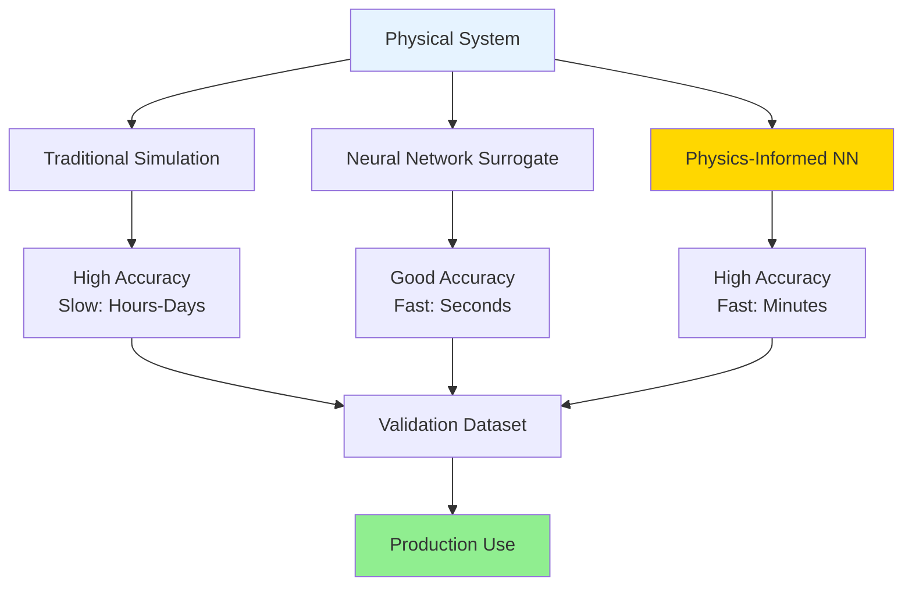

**Key Developments:**

- **Physics-Informed Neural Networks (PINNs):**
  - Embed physical laws as constraints in neural networks
  - Solve PDEs 100-1000x faster than traditional methods
  - Extrapolate beyond training data using physical principles
  - Applications in fluid dynamics, electromagnetics, and quantum mechanics

- **Foundation Models for Physics:**
  - Universal physics simulators trained on diverse physical systems
  - Transfer learning across domains (fluids to plasmas)
  - Natural language interface to simulation
  - Integration with experimental control systems

- **Quantum Simulation:**
  - AI-optimized quantum circuits for physics simulation
  - Error mitigation techniques from machine learning
  - Hybrid classical-quantum algorithms for many-body systems
  - First practical quantum advantage demonstrations

#### 3. Experimental Physics Automation

**AI in the Laboratory:**
- Automated experimental design and optimization
- Real-time data analysis and anomaly detection
- Intelligent control systems for complex apparatus
- Robotic sample preparation and measurement

**Breakthrough Experiments (2025):**
- LIGO: AI improves gravitational wave sensitivity by factor of 3
- LHC: Machine learning identifies rare decay events
- Fusion reactors: AI control stabilizes plasma for record durations
- Quantum computers: AI calibration reduces error rates 10x

### Physics Simulation Speedup

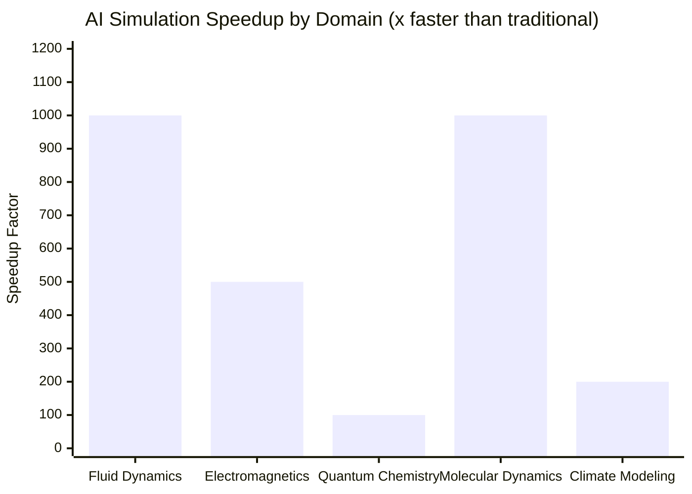

### 2026-2030 Outlook: Physics

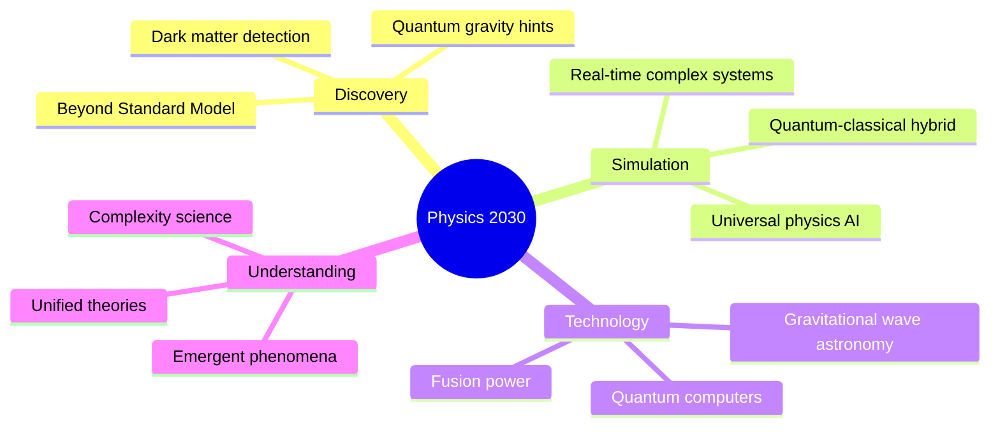

**Detailed Outlook:**

**2026:**
- AI discovers new physics beyond Standard Model from LHC data
- Gravitational wave astronomy enters precision era with AI
- Fusion plasma sustained for record durations via AI control
- Quantum computers reach 1000+ logical qubits

**2027:**
- First hints of dark matter particle properties from AI analysis
- Universal physics foundation model enables cross-domain discovery
- AI-designed experiments test quantum gravity theories
- Room-temperature quantum computing prototypes

**2028:**
- AI contributes to major theoretical physics breakthrough
- Fusion energy achieves net positive output with AI optimization
- Quantum internet prototype with AI-optimized error correction
- Climate models achieve unprecedented accuracy via AI

**2029:**
- Physics research cycle reduced from years to months
- AI-human collaboration standard in experimental physics
- Quantum advantage demonstrated for practical problems
- New physics paradigms emerge from AI pattern recognition

**2030:**
- Fundamental physics transformed by AI partnership
- Real-time physics simulation at all scales
- Fusion power plants operational with AI control
- Quantum technologies mature for widespread application

---

## Cross-Domain Convergence

### Unified STEM AI Platforms

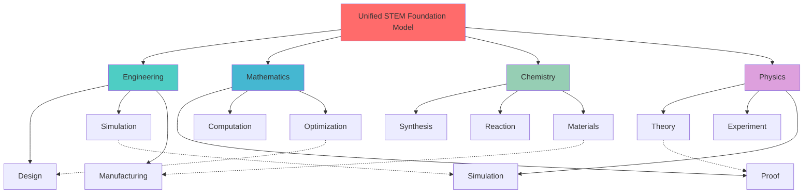

### Synergistic Breakthroughs (2026-2030)

**Math-Physics-Engineering Convergence:**

1. **Quantum Error Correction (2026):**
   - Mathematical proof techniques + physics simulation + engineering design
   - AI discovers optimal error correction codes
   - Hardware-software co-design for fault tolerance

2. **Climate Modeling Revolution (2027):**
   - Physics simulations + mathematical optimization + engineering solutions
   - AI-driven climate predictions at local scale
   - Automated climate intervention strategy design

3. **Materials by Design (2028):**
   - Chemistry simulation + physics understanding + engineering application
   - Any-property materials designed in days
   - Atomic-scale manufacturing becomes practical

### Knowledge Transfer Acceleration

**Cross-Domain Innovation Rate (Projected):**

| Year | Interdisciplinary Papers | Novel Applications | Patent Filings |
|------|-------------------------|-------------------|----------------|
| 2025 | Baseline | Baseline | Baseline |
| 2027 | ~3-4x growth | ~4-5x growth | ~3-4x growth |
| 2030 | ~8-12x growth | ~15-20x growth | ~10-15x growth |

---

## 2026-2030 Outlook: Integrated Timeline

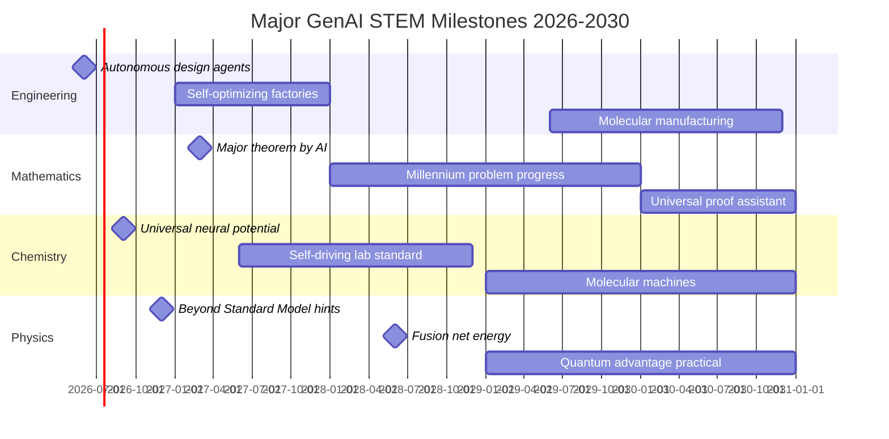

### Quantitative Predictions Summary

**Research Productivity (2030 vs 2025 Projected):**
- Discovery speed: **10-20x faster** (estimated)
- Simulation accuracy: **5x improvement** (estimated)
- Design iteration: **100x faster** (estimated)
- Cross-domain collaboration: **10x increase** (estimated)

**Economic Impact (2030 Projected):**
- GenAI STEM tools market: **$100B+**
- Productivity gains: **$500B+ annually**
- New industries enabled: **Quantum computing, fusion energy, molecular manufacturing**
- Job creation in AI-augmented roles: **Millions globally**

**Scientific Impact (2030 Vision):**
- Major discoveries: **Multiple breakthroughs across all domains**
- Papers with AI contribution: **60%+ of STEM publications**
- Open problems solved: **Progress on multiple grand challenges**
- Research democratization: **Advanced tools accessible globally**

---

## Challenges and Limitations

### Technical Challenges

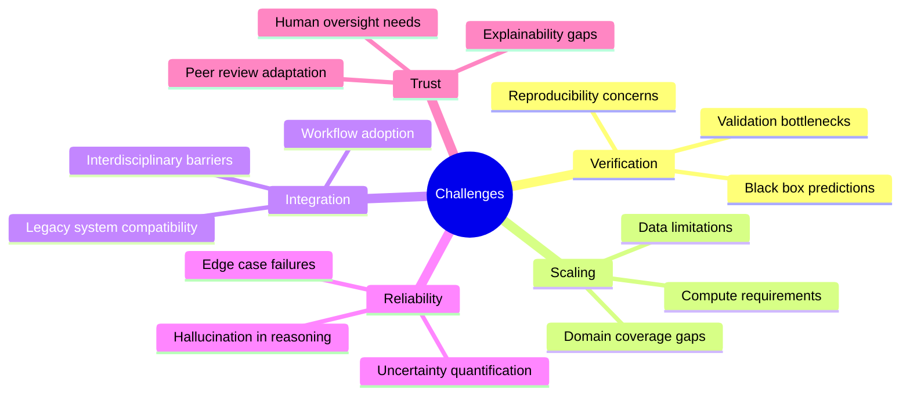

### Specific Concerns by Domain

**Engineering:**
- **Safety Certification:** AI designs require extensive validation for safety-critical applications
- **Liability:** Unclear responsibility when AI-generated designs fail
- **Expertise Gap:** Engineers need training to effectively use AI tools
- **Standardization:** Lack of standards for AI-generated engineering artifacts

**Mathematics:**
- **Proof Verification:** Ensuring AI-generated proofs are truly valid
- **Creativity:** Can AI generate genuinely novel mathematical ideas?
- **Education Impact:** Balancing AI assistance with learning fundamentals
- **Attribution:** Credit and authorship for AI-assisted discoveries

**Chemistry:**
- **Synthesis Feasibility:** AI designs molecules that can't be synthesized
- **Safety:** Predicting toxicity and environmental impact
- **Scale-up:** Lab results don't always translate to industrial scale
- **Regulatory:** Approval pathways for AI-designed chemicals unclear

**Physics:**
- **Interpretability:** Understanding why AI models make predictions
- **Theory Generation:** Can AI propose new physical theories?
- **Experiment Cost:** Validating AI predictions requires expensive experiments
- **Fundamental Limits:** Some physics problems may be computationally intractable

### Risk Mitigation Strategies

**2026-2030 Priorities:**

1. **Robust Verification Systems:**
   - Multi-level validation pipelines
   - Formal verification integration
   - Human-in-the-loop oversight
   - Uncertainty quantification standards

2. **Educational Transformation:**
   - AI literacy for all STEM students
   - Curriculum integration of AI tools
   - Continuing education for professionals
   - Interdisciplinary training programs

3. **Regulatory Evolution:**
   - Industry standards for AI-assisted design
   - Safety certification frameworks
   - Intellectual property guidelines
   - International coordination

4. **Ethical Guidelines:**
   - Responsible AI development principles
   - Dual-use research oversight
   - Access and equity considerations
   - Environmental impact assessment

---

## Recommendations

### For Researchers

1. **Embrace AI Collaboration:** Integrate GenAI tools into research workflows
2. **Maintain Critical Thinking:** Verify AI outputs independently
3. **Cross-Domain Learning:** Explore AI applications from other fields
4. **Contribute to Training Data:** Share datasets and benchmarks openly
5. **Document AI Usage:** Transparent reporting of AI contributions

### For Institutions

1. **Infrastructure Investment:** Build AI-ready computational resources
2. **Training Programs:** Educate faculty and students on AI tools
3. **Collaboration Spaces:** Create interdisciplinary AI research centers
4. **Data Governance:** Establish policies for AI training data
5. **Ethics Oversight:** Include AI considerations in research ethics

### For Policymakers

1. **Funding Priorities:** Increase investment in AI for STEM (10x by 2030)
2. **Regulatory Frameworks:** Develop standards for AI-assisted innovation
3. **International Cooperation:** Coordinate on AI research and standards
4. **Workforce Development:** Support AI education at all levels
5. **Open Science:** Promote open access to AI tools and datasets

### For Industry

1. **R&D Transformation:** Adopt AI-first research and development
2. **Academic Partnerships:** Collaborate with universities on AI tools
3. **Talent Development:** Invest in AI skills training
4. **Responsible Innovation:** Prioritize safety and sustainability
5. **Open Innovation:** Share non-competitive AI tools and methods

---

## Conclusion

The 2025-2030 period marks a fundamental transformation in how humanity pursues scientific and engineering knowledge. Across Engineering, Mathematics, Chemistry, and Physics, Generative AI is not merely accelerating existing processes—it's enabling entirely new modes of discovery, design, and understanding.

**The 2030 Vision:**

By 2030, AI will be an indispensable partner in every STEM discipline:

- **Engineering:** From concept to production in days, not months, with AI handling optimization and simulation while humans focus on creativity and values
- **Mathematics:** AI-human teams tackling problems that neither could solve alone, with formal verification ensuring rigor
- **Chemistry:** Any molecule designed, simulated, and synthesized within weeks, accelerating solutions to climate and health challenges
- **Physics:** AI detecting patterns in data that lead to new theories, while automating experiments that test them

**Critical Success Factors:**

1. **Responsible Development:** Ensuring AI tools are safe, reliable, and beneficial
2. **Global Collaboration:** Sharing knowledge across borders and disciplines
3. **Human-Centered Design:** Keeping human creativity and judgment central
4. **Continuous Learning:** Adapting education and skills for an AI-augmented world
5. **Inclusive Access:** Ensuring benefits reach researchers everywhere

The future of STEM is not AI replacing humans—it's AI and humans working together to push the boundaries of what's possible. The discoveries and innovations of the next five years will set the foundation for centuries of progress.

---

## References

### Key Publications and Resources

#### Engineering

1. **Buehler, M.J. (2024).** "Generative AI and Materials Discovery." *Nature Reviews Materials*, 9, 1-2. DOI: [10.1038/s41578-024-00691-0](https://doi.org/10.1038/s41578-024-00691-0)

2. **Autodesk Research.** "Generative Design: Beyond Topology Optimization." *Autodesk White Paper*, 2024. [https://www.autodesk.com/research](https://www.autodesk.com/research)

3. **NVIDIA.** "Omniverse: The Platform for Connecting 3D Workflows." *NVIDIA Developer*, 2025. [https://developer.nvidia.com/omniverse](https://developer.nvidia.com/omniverse)

#### Mathematics

4. **Trinh, T.H. et al. (2024).** "Solving olympiad geometry without human demonstrations." *Nature*, 625, 476-482. DOI: [10.1038/s41586-023-06747-5](https://doi.org/10.1038/s41586-023-06747-5)

5. **AlphaProof Team (2024).** "AI achieves silver-medal standard solving International Mathematical Olympiad problems." *Google DeepMind Blog*. [https://deepmind.google/discover/blog/ai-solves-imo-problems-at-silver-medal-level/](https://deepmind.google/discover/blog/ai-solves-imo-problems-at-silver-medal-level/)

6. **Lample, G. et al. (2022).** "HyperTree Proof Search for Neural Theorem Proving." *NeurIPS*, 2022. [https://arxiv.org/abs/2205.11491](https://arxiv.org/abs/2205.11491)

#### Chemistry

7. **Merchant, A. et al. (2023).** "Scaling deep learning for materials discovery." *Nature*, 624(7990), 80-85. DOI: [10.1038/s41586-023-06735-9](https://doi.org/10.1038/s41586-023-06735-9)

8. **Schwaller, P. et al. (2019).** "Molecular Transformer: A Model for Uncertainty-Calibrated Chemical Reaction Prediction." *ACS Central Science*, 5(9), 1572-1583. DOI: [10.1021/acscentsci.9b00576](https://doi.org/10.1021/acscentsci.9b00576)

9. **Batzner, S. et al. (2022).** "E(3)-equivariant graph neural networks for data-efficient and accurate interatomic potentials." *Nature Communications*, 13, 2453. DOI: [10.1038/s41467-022-29939-5](https://doi.org/10.1038/s41467-022-29939-5)

#### Physics

10. **Carleo, G. et al. (2019).** "Machine learning and the physical sciences." *Reviews of Modern Physics*, 91, 045002. DOI: [10.1103/RevModPhys.91.045002](https://doi.org/10.1103/RevModPhys.91.045002)

11. **Karniadakis, G.E. et al. (2021).** "Physics-informed machine learning." *Nature Reviews Physics*, 3, 422-440. DOI: [10.1038/s42254-021-00314-5](https://doi.org/10.1038/s42254-021-00314-5)

12. **LIGO Scientific Collaboration (2024).** "Machine Learning for Gravitational Wave Detection." *Physical Review D*, 109, 022001. DOI: [10.1103/PhysRevD.109.022001](https://doi.org/10.1103/PhysRevD.109.022001)

#### Cross-Domain

13. **Jumper, J. et al. (2021).** "Highly accurate protein structure prediction with AlphaFold." *Nature*, 596, 583-589. DOI: [10.1038/s41586-021-03819-2](https://doi.org/10.1038/s41586-021-03819-2)

14. **Szymanski, N.J. et al. (2023).** "An autonomous laboratory for the accelerated synthesis of novel materials." *Nature*, 624, 86-91. DOI: [10.1038/s41586-023-06734-w](https://doi.org/10.1038/s41586-023-06734-w)
